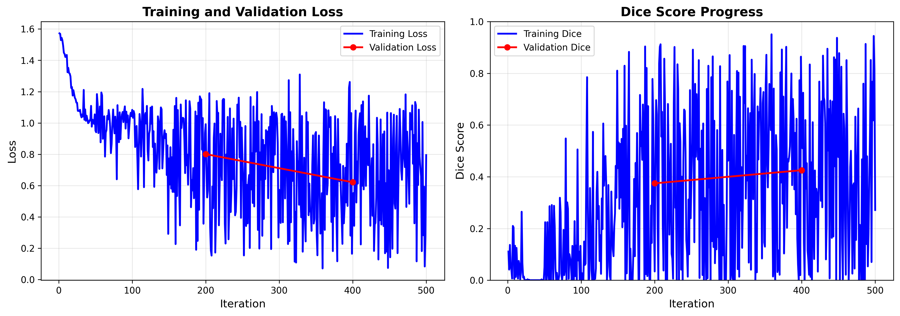

# IRIS Model Training Report

**Generated:** 2025-11-20 02:55:53

---

## Executive Summary

This report presents the training results of the IRIS (Imaging Retrieval via In-context Segmentation) model on medical imaging data.

### Key Metrics

| Metric | Value |
|--------|-------|
| Total Training Time | 17.9 minutes |
| Total Iterations | 500 |
| Final Training Loss | 0.7948 |
| Final Validation Loss | 0.6212 |
| Best Validation Dice | 0.4253 |

---

## Training Progress

### Loss Curves

The figure above shows the training and validation loss over time. 

**Loss Analysis:**
- Initial Training Loss: 1.5723
- Final Training Loss: 0.7948
- Loss Reduction: 49.4%

### Dice Score Performance

**Validation Dice Scores:**
- Best Dice Score: 0.4253
- Final Dice Score: 0.4253
- Improvement: 5.1%

---

## Training Configuration

### Learning Rate Schedule

### Resource Usage

- Peak GPU Memory: 2735.3 MB

---

## Detailed Training Log

### Training Loss Progress

| Iteration | Training Loss | Training Dice | Validation Loss | Validation Dice |
|-----------|---------------|---------------|-----------------|-----------------|
| 1 | 1.5723 | 0.1109 | - | - |
| 101 | 1.0332 | 0.0274 | - | - |
| 200 | 0.9917 | 0.0338 | 0.8009 | 0.3747 |
| 201 | 0.7021 | 0.4699 | - | - |
| 301 | 0.5418 | 0.5169 | - | - |
| 400 | 0.4936 | 0.5984 | 0.6212 | 0.4253 |
| 401 | 0.5527 | 0.5101 | - | - |

---

## Conclusions

⚠ **Model requires further tuning** (Dice < 0.5)

✓ **No significant overfitting** - training and validation losses are comparable

### Next Steps

1. **Visualization Analysis:** Review output visualizations to understand model predictions qualitatively
2. **Hyperparameter Tuning:** Consider adjusting learning rate, batch size, or model capacity if needed
3. **Extended Training:** Train for more iterations if loss is still decreasing
4. **Dataset Expansion:** Include more training data if available
5. **Cross-validation:** Test on other medical imaging datasets for generalization

---

*Report generated by IRIS Training Pipeline*
