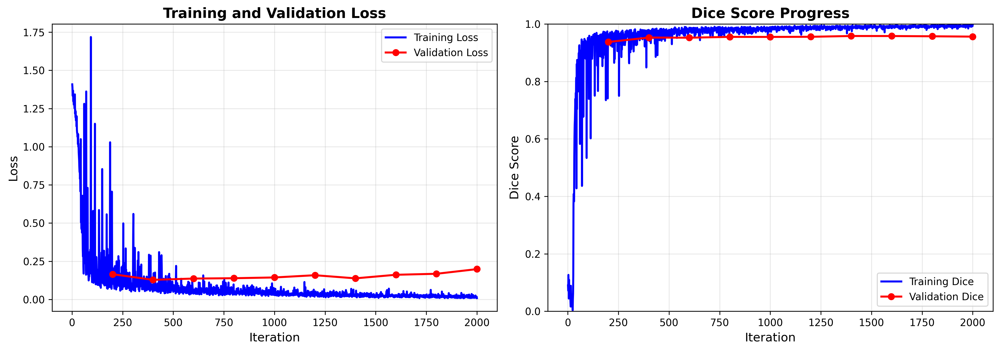
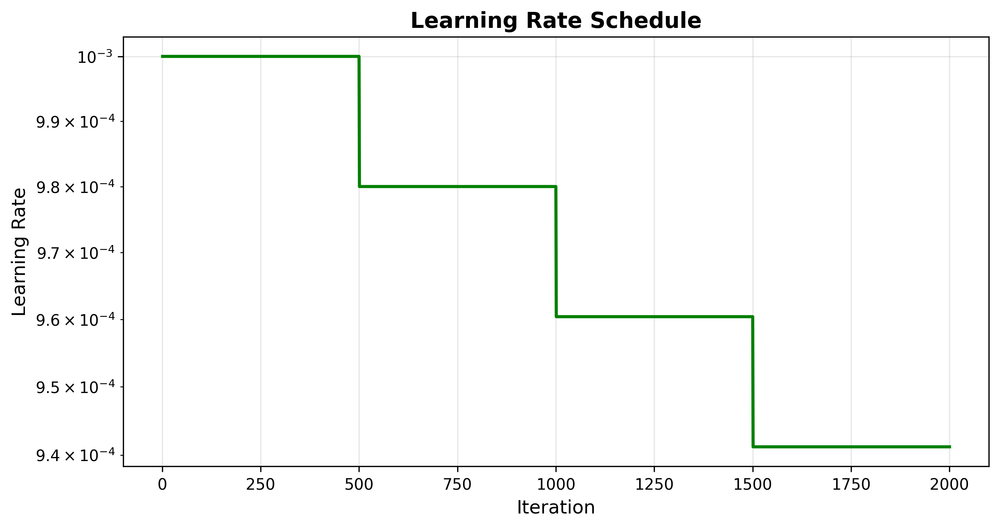

# IRIS Model Training Report

**Generated:** 2025-11-19 23:32:26

---

## Executive Summary

This report presents the training results of the IRIS (Imaging Retrieval via In-context Segmentation) model on medical imaging data.

### Key Metrics

| Metric | Value |
|--------|-------|
| Total Training Time | 211.0 minutes |
| Total Iterations | 2000 |
| Final Training Loss | 0.0088 |
| Final Validation Loss | 0.1985 |
| Best Validation Dice | 0.9581 |

---

## Training Progress

### Loss Curves

The figure above shows the training and validation loss over time. 

**Loss Analysis:**
- Initial Training Loss: 1.4085
- Final Training Loss: 0.0088
- Loss Reduction: 99.4%

### Dice Score Performance

**Validation Dice Scores:**
- Best Dice Score: 0.9581
- Final Dice Score: 0.9560
- Improvement: 1.9%

---

## Training Configuration

### Learning Rate Schedule

### Resource Usage

- Peak GPU Memory: 777.7 MB

---

## Detailed Training Log

### Training Loss Progress

| Iteration | Training Loss | Training Dice | Validation Loss | Validation Dice |
|-----------|---------------|---------------|-----------------|-----------------|
| 701 | 0.0564 | 0.9794 | - | - |
| 800 | 0.0337 | 0.9836 | 0.1390 | 0.9551 |
| 801 | 0.0365 | 0.9854 | - | - |
| 901 | 0.0274 | 0.9905 | - | - |
| 1000 | 0.0296 | 0.9855 | 0.1440 | 0.9549 |
| 1001 | 0.0486 | 0.9800 | - | - |
| 1101 | 0.0493 | 0.9821 | - | - |
| 1200 | 0.0363 | 0.9849 | 0.1586 | 0.9554 |
| 1201 | 0.0271 | 0.9872 | - | - |
| 1301 | 0.0324 | 0.9874 | - | - |
| 1400 | 0.0339 | 0.9864 | 0.1382 | 0.9581 |
| 1401 | 0.0195 | 0.9926 | - | - |
| 1501 | 0.0247 | 0.9902 | - | - |
| 1600 | 0.0209 | 0.9926 | 0.1615 | 0.9580 |
| 1601 | 0.0290 | 0.9854 | - | - |
| 1701 | 0.0158 | 0.9935 | - | - |
| 1800 | 0.0226 | 0.9929 | 0.1680 | 0.9571 |
| 1801 | 0.0157 | 0.9936 | - | - |
| 1901 | 0.0243 | 0.9914 | - | - |
| 2000 | 0.0088 | 0.9966 | 0.1985 | 0.9560 |

---

## Conclusions

✓ **Model achieved good performance** (Dice > 0.7)

⚠ **Potential overfitting detected** - validation loss significantly higher than training loss

### Next Steps

1. **Visualization Analysis:** Review output visualizations to understand model predictions qualitatively
2. **Hyperparameter Tuning:** Consider adjusting learning rate, batch size, or model capacity if needed
3. **Extended Training:** Train for more iterations if loss is still decreasing
4. **Dataset Expansion:** Include more training data if available
5. **Cross-validation:** Test on other medical imaging datasets for generalization

---

*Report generated by IRIS Training Pipeline*
