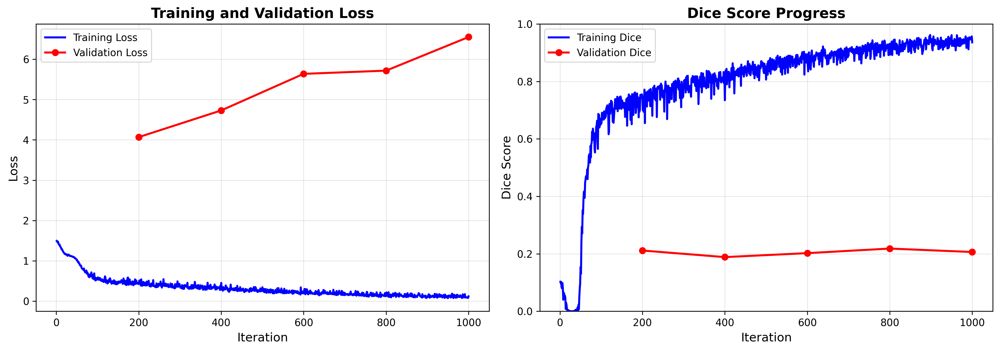
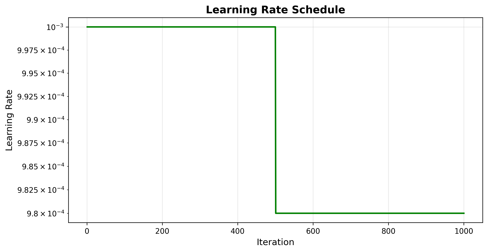

# IRIS Model Training Report

**Generated:** 2025-11-20 05:20:35

---

## Executive Summary

This report presents the training results of the IRIS (Imaging Retrieval via In-context Segmentation) model on medical imaging data.

### Key Metrics

| Metric | Value |
|--------|-------|
| Total Training Time | 36.6 minutes |
| Total Iterations | 1000 |
| Final Training Loss | 0.1183 |
| Final Validation Loss | 6.5511 |
| Best Validation Dice | 0.2182 |

---

## Training Progress

### Loss Curves

The figure above shows the training and validation loss over time. 

**Loss Analysis:**
- Initial Training Loss: 1.4929
- Final Training Loss: 0.1183
- Loss Reduction: 92.1%

### Dice Score Performance

**Validation Dice Scores:**
- Best Dice Score: 0.2182
- Final Dice Score: 0.2062
- Improvement: -0.5%

---

## Training Configuration

### Learning Rate Schedule

### Resource Usage

- Peak GPU Memory: 2734.7 MB

---

## Detailed Training Log

### Training Loss Progress

| Iteration | Training Loss | Training Dice | Validation Loss | Validation Dice |
|-----------|---------------|---------------|-----------------|-----------------|
| 1 | 1.4929 | 0.1027 | - | - |
| 101 | 0.5872 | 0.6577 | - | - |
| 200 | 0.4527 | 0.7391 | 4.0686 | 0.2114 |
| 201 | 0.5071 | 0.6994 | - | - |
| 301 | 0.3339 | 0.8030 | - | - |
| 400 | 0.4516 | 0.7345 | 4.7302 | 0.1885 |
| 401 | 0.3132 | 0.8142 | - | - |
| 501 | 0.2596 | 0.8495 | - | - |
| 600 | 0.2340 | 0.8769 | 5.6380 | 0.2023 |
| 601 | 0.2398 | 0.8593 | - | - |
| 701 | 0.1749 | 0.9109 | - | - |
| 800 | 0.1400 | 0.9309 | 5.7173 | 0.2182 |
| 801 | 0.2155 | 0.8932 | - | - |
| 901 | 0.0993 | 0.9479 | - | - |
| 1000 | 0.1183 | 0.9360 | 6.5511 | 0.2062 |

---

## Conclusions

⚠ **Model requires further tuning** (Dice < 0.5)

⚠ **Potential overfitting detected** - validation loss significantly higher than training loss

### Next Steps

1. **Visualization Analysis:** Review output visualizations to understand model predictions qualitatively
2. **Hyperparameter Tuning:** Consider adjusting learning rate, batch size, or model capacity if needed
3. **Extended Training:** Train for more iterations if loss is still decreasing
4. **Dataset Expansion:** Include more training data if available
5. **Cross-validation:** Test on other medical imaging datasets for generalization

---

*Report generated by IRIS Training Pipeline*
