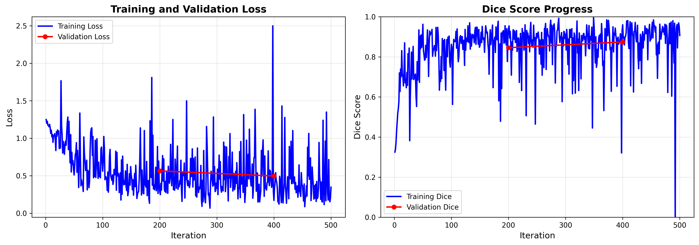
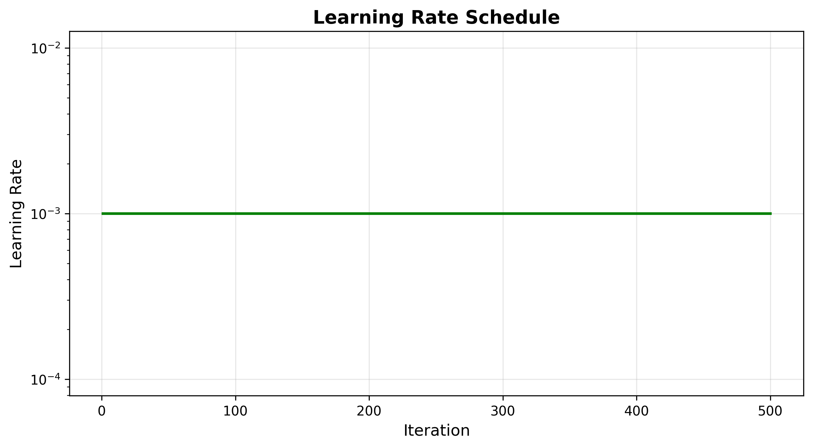

# IRIS Model Training Report

**Generated:** 2025-11-20 01:03:41

---

## Executive Summary

This report presents the training results of the IRIS (Imaging Retrieval via In-context Segmentation) model on medical imaging data.

### Key Metrics

| Metric | Value |
|--------|-------|
| Total Training Time | 31.5 minutes |
| Total Iterations | 500 |
| Final Training Loss | 0.3478 |
| Final Validation Loss | 0.4966 |
| Best Validation Dice | 0.8742 |

---

## Training Progress

### Loss Curves

The figure above shows the training and validation loss over time. 

**Loss Analysis:**
- Initial Training Loss: 1.2496
- Final Training Loss: 0.3478
- Loss Reduction: 72.2%

### Dice Score Performance

**Validation Dice Scores:**
- Best Dice Score: 0.8742
- Final Dice Score: 0.8742
- Improvement: 2.8%

---

## Training Configuration

### Learning Rate Schedule

### Resource Usage

- Peak GPU Memory: 2735.3 MB

---

## Detailed Training Log

### Training Loss Progress

| Iteration | Training Loss | Training Dice | Validation Loss | Validation Dice |
|-----------|---------------|---------------|-----------------|-----------------|
| 1 | 1.2496 | 0.3249 | - | - |
| 101 | 0.6949 | 0.8458 | - | - |
| 200 | 0.2920 | 0.9379 | 0.5643 | 0.8457 |
| 201 | 0.2479 | 0.9541 | - | - |
| 301 | 0.5879 | 0.8342 | - | - |
| 400 | 0.1715 | 0.9597 | 0.4966 | 0.8742 |
| 401 | 0.3328 | 0.8947 | - | - |

---

## Conclusions

✓ **Model achieved good performance** (Dice > 0.7)

✓ **No significant overfitting** - training and validation losses are comparable

### Next Steps

1. **Visualization Analysis:** Review output visualizations to understand model predictions qualitatively
2. **Hyperparameter Tuning:** Consider adjusting learning rate, batch size, or model capacity if needed
3. **Extended Training:** Train for more iterations if loss is still decreasing
4. **Dataset Expansion:** Include more training data if available
5. **Cross-validation:** Test on other medical imaging datasets for generalization

---

*Report generated by IRIS Training Pipeline*
