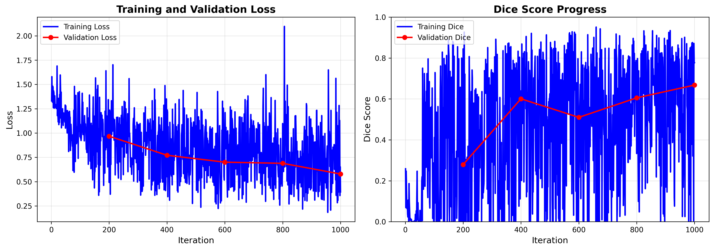

# IRIS Model Training Report

**Generated:** 2025-11-20 04:28:06

---

## Executive Summary

This report presents the training results of the IRIS (Imaging Retrieval via In-context Segmentation) model on medical imaging data.

### Key Metrics

| Metric | Value |
|--------|-------|
| Total Training Time | 31.9 minutes |
| Total Iterations | 1000 |
| Final Training Loss | 0.3934 |
| Final Validation Loss | 0.5784 |
| Best Validation Dice | 0.6676 |

---

## Training Progress

### Loss Curves

The figure above shows the training and validation loss over time. 

**Loss Analysis:**
- Initial Training Loss: 1.3306
- Final Training Loss: 0.3934
- Loss Reduction: 70.4%

### Dice Score Performance

**Validation Dice Scores:**
- Best Dice Score: 0.6676
- Final Dice Score: 0.6676
- Improvement: 38.8%

---

## Training Configuration

### Learning Rate Schedule

### Resource Usage

- Peak GPU Memory: 2735.3 MB

---

## Detailed Training Log

### Training Loss Progress

| Iteration | Training Loss | Training Dice | Validation Loss | Validation Dice |
|-----------|---------------|---------------|-----------------|-----------------|
| 1 | 1.3306 | 0.2586 | - | - |
| 101 | 0.9494 | 0.4122 | - | - |
| 200 | 0.4915 | 0.8446 | 0.9673 | 0.2793 |
| 201 | 0.7128 | 0.6694 | - | - |
| 301 | 0.6242 | 0.6536 | - | - |
| 400 | 0.5499 | 0.6390 | 0.7712 | 0.6005 |
| 401 | 1.2374 | 0.2692 | - | - |
| 501 | 1.0740 | 0.0000 | - | - |
| 600 | 0.7011 | 0.4992 | 0.7001 | 0.5099 |
| 601 | 1.2102 | 0.2169 | - | - |
| 701 | 1.0748 | 0.3616 | - | - |
| 800 | 1.0976 | 0.3331 | 0.6882 | 0.6052 |
| 801 | 0.7683 | 0.5799 | - | - |
| 901 | 1.0551 | 0.1690 | - | - |
| 1000 | 0.3934 | 0.7767 | 0.5784 | 0.6676 |

---

## Conclusions

⚠ **Model shows moderate performance** (0.5 < Dice < 0.7)

✓ **No significant overfitting** - training and validation losses are comparable

### Next Steps

1. **Visualization Analysis:** Review output visualizations to understand model predictions qualitatively
2. **Hyperparameter Tuning:** Consider adjusting learning rate, batch size, or model capacity if needed
3. **Extended Training:** Train for more iterations if loss is still decreasing
4. **Dataset Expansion:** Include more training data if available
5. **Cross-validation:** Test on other medical imaging datasets for generalization

---

*Report generated by IRIS Training Pipeline*
